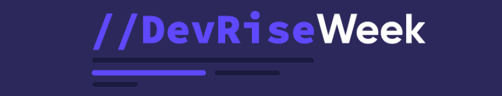
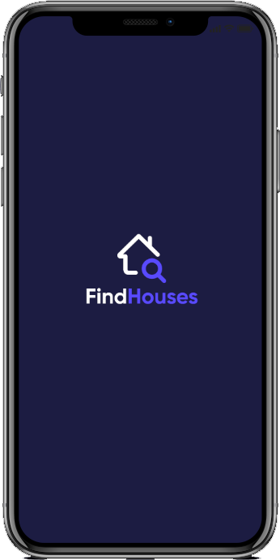

<!-- Logotipo -->
<div align="center">
   
</div>

<!-- Title -->
<h1 align="center">Seven Coders - DevRiseWeek</h1>

<!-- Subtitle -->
<h2 align="center"> Projeto : Find Houses 🏘️ </h2>

| Data  | Programação               | Status |
| ----- | ------------------------- | ------ |
| 24/03 | Conhecendo o Projeto      | ✔️      |
| 25/03 | Arquitetura Atomic        | 🚧      |
| 26/03 | Lista de Imóveis via API  | 🚧      |
| 27/03 | Navegação e Estado Global | 🚧      |
| 28/03 | Finalizando a Aplicação   | 🚧      |


<!-- Badges -->
<p align="center">
  
  
  
</p>

<!-- Sobre o Projeto -->
## 🚀 Sobre o Projeto

## 🖼️ Imagens do Projeto

<div align="center">
   
</div>


## 🧰 Tecnologias e Bibliotecas
* [React Native](https://reactnative.dev/)

## ⚙️ Rodando o Projeto
```bash
# Clone este repositório para a pasta anterior
$ git clone https://github.com/brunoemferreira/DevRiseWeek.git
# ou use a opção de download.

# Acesse a pasta dtmoney
$ cd FindHouses

# Instale as dependências
$ yarn install
ou
$ npm install

# Executando o Projeto
$ yarn android 

```
